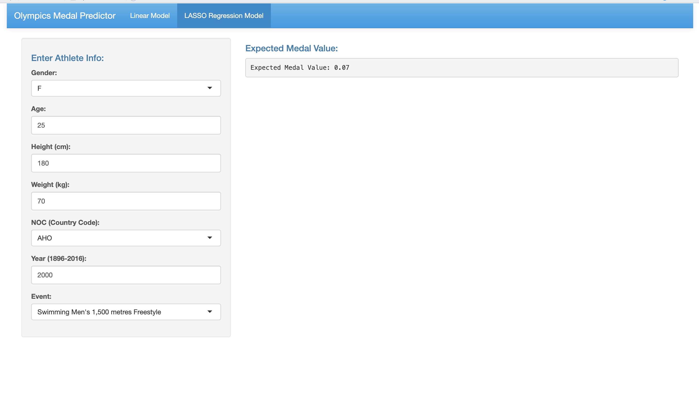
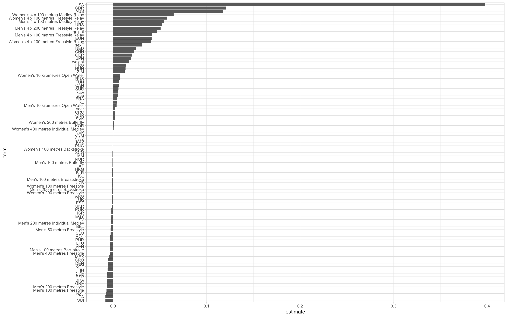
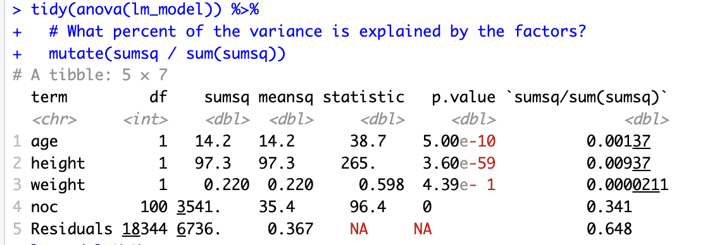

# r-olympic-swimming-predictor
This is a shiny app built with R that forecasts Olympic medals in swimming events through two different methods: Linear and LASSO regression modeling.

---

## Overview
This app uses athlete data from the 8/6/2024 TidyTuesday project "Olympic Medals". The data provided from TidyTuesday is sourced from Kaggle's Olympic history data, which covers the Olympics between 1896-2016. In this model, we focus solely on swimming events to base our model upon. Users can input gender (sex), age, height, weight, country (NOC codes), year, and Olympic event to get a predicted medal value.

Medal values are as follows:
- Gold -> 3
- Silver -> 2
- Bronze -> 1
- Example: If the model predicts a 1.6, the athlete is expected to win a bronze or silver medal.

By running the Shiny App, users can choose between the different regression models through the nav bar and explore however they want!

The goal of this project was to see what factors influence swimming success at the Olympics.

---

## Findings
Based on both the linear and LASSO regression models, we can see that Countries had a major influence on predicted medal values.

- Athletes from historically good countries (USA, USSR, East and West Germany, UK) had significantly higher predicted medal values
- This is supported with historical records, as these countries are known to have better training programs and resources
- Doping issues in East and West Germany explain a large part why they were so successful and this is reflected in the data

Most other factors had a much lesser effect although still present

Through linear regression model:
- Age, weight, and height saw very small confidence intervals
- Although accounting for small precents of variation, definetly factor into medalling
- Since swimming is known to have a slightly stricter age and height range compared to weight, this data doesn't surprise me
- I could've done better with the lm model as I'm sure these variables probably explain more variance in the data than my model shows

Through LASSO regression model:
- Variance seen in age, weight, and height
- Event also plays a fairly big role, relays where less entries overall are made sees a higher chance of getting a medal
- Less popular events like open water saw higher chances of medaling

Overall, both the Linear and LASSO regression models account for 35-45% of the variation in the data. So although not perfect, it gives pretty good insight into some of the factors that affect high level swimming!

---

## How to run
1. Clone this repo or download the R.md file.
2. Open R.studio
3. Run the Shiny app
